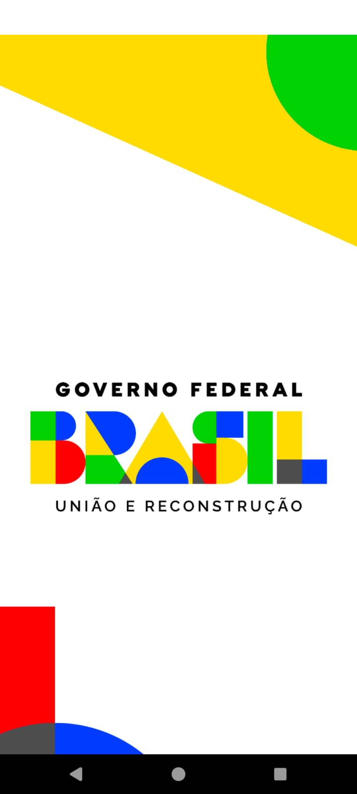
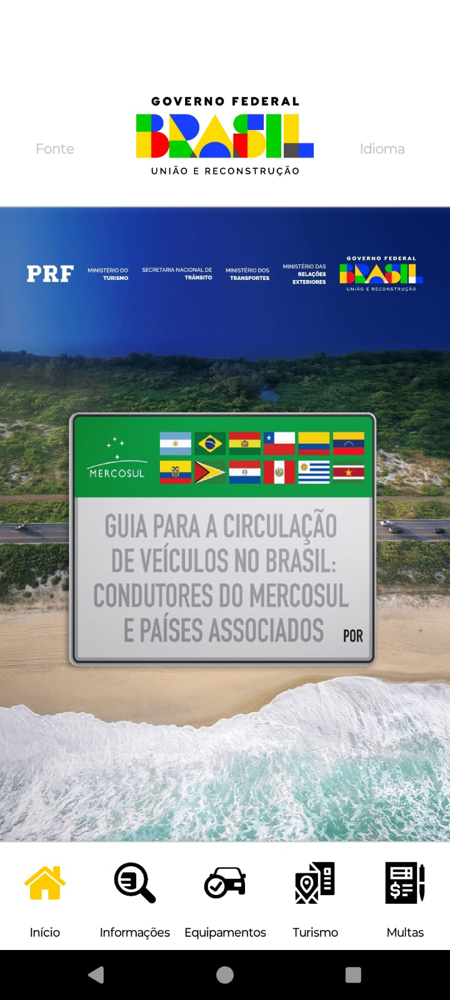
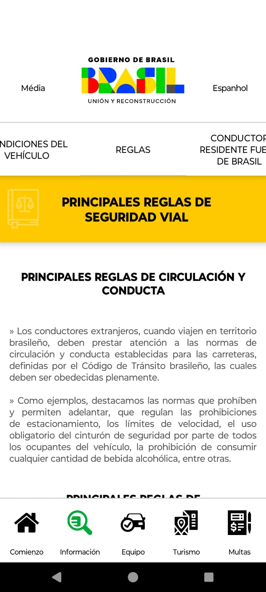
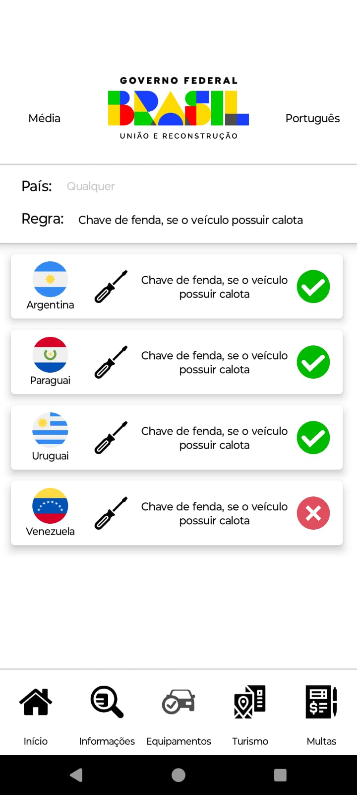
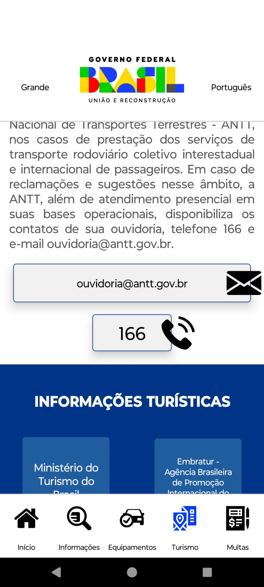
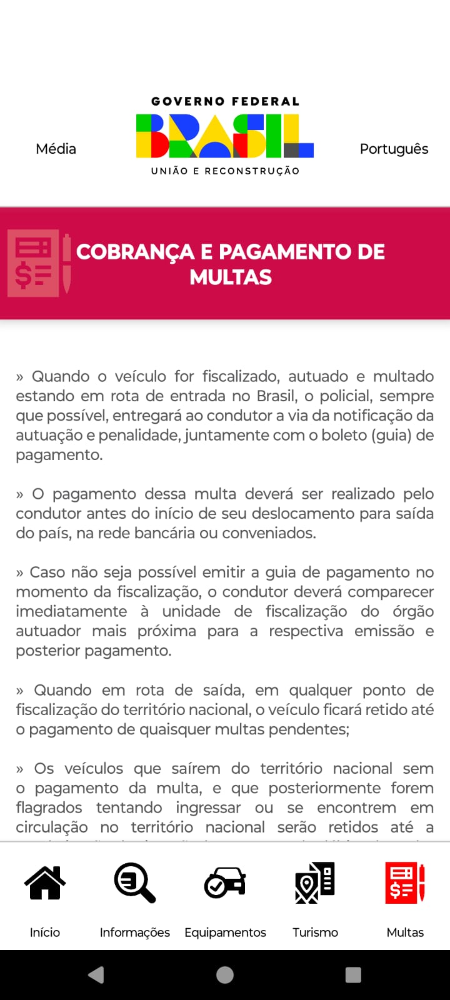

# 📱 Aplicativo Mercosul - Cartilha para Motoristas Estrangeiros 🚗

O **Mercosul** é um aplicativo desenvolvido com **React Native** e **Expo**, criado como uma cartilha digital para motoristas estrangeiros que transitam no Brasil, especialmente aqueles provenientes de países do Mercosul, devido à construção da **Rota Bioceânica**. O app foi desenvolvido para o **Ministério de Relações Exteriores** com o objetivo de fornecer informações essenciais para facilitar a navegação e a segurança desses motoristas no território brasileiro.

## 🔧 Funcionalidades

- **Regras de Trânsito no Brasil**: Instruções sobre as leis de trânsito e sinais específicos do Brasil para motoristas estrangeiros.
- **Emergências**: Orientações sobre o que fazer em caso de emergência ou acidentes no Brasil.
- **Multilinguagem**: Suporte a múltiplos idiomas para facilitar o uso por motoristas de diferentes países.

## 🚀 Tecnologias Utilizadas

- **React Native** com **Expo** para o desenvolvimento do aplicativo.
- **React Navigation** para navegação entre telas.
- **Axios** para realizar requisições HTTP (se necessário).
- **Expo Managed Workflow** para facilitar o processo de desenvolvimento.

## 📸 Prints do Aplicativo

Abaixo estão alguns prints do aplicativo **Mercosul** em funcionamento:

### Tela de Carregamento

### Landing

### Tela de Informações

### Tela de Equipamentos

### Tela de Turismo

### Tela de Multas

